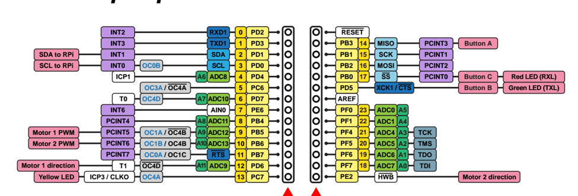
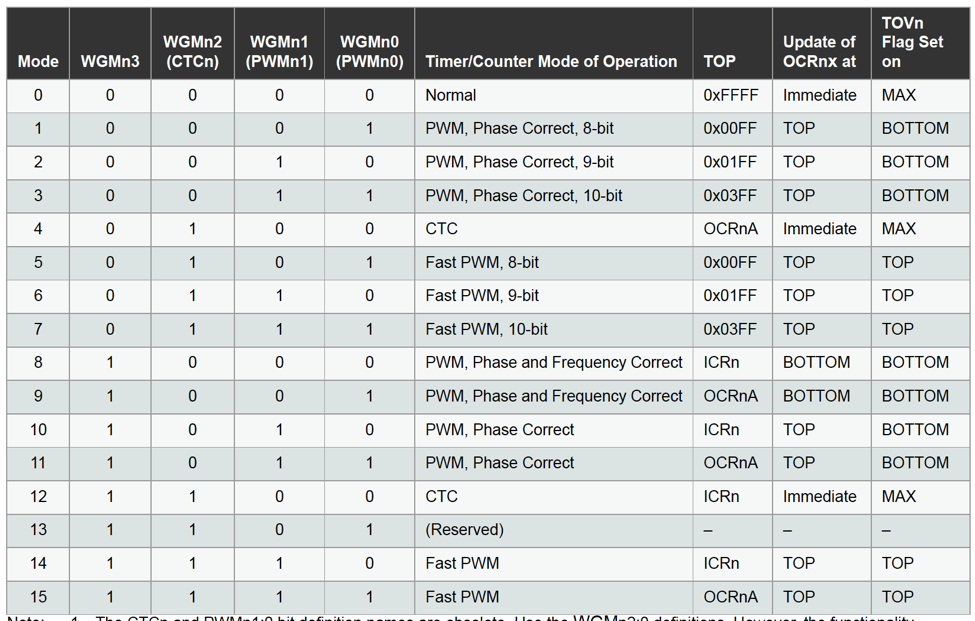
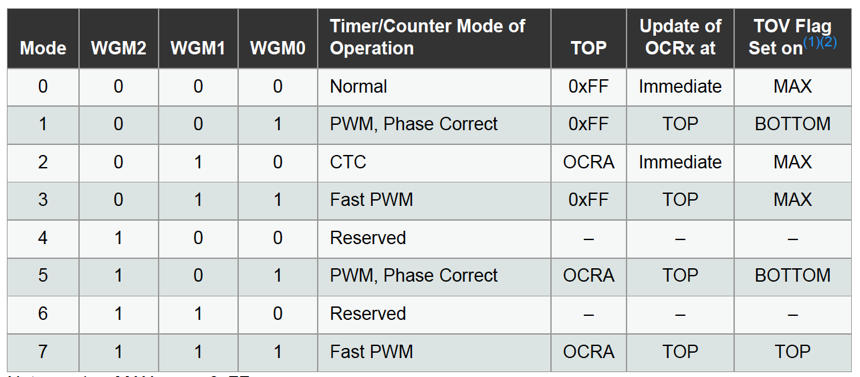

### Functionality - Port Connections

#### LEDS

PB0 : red
PC7 : yellow
PD5 : green

#### Buttons

A : PB3 : PCINT3
B : PD5 : -
C : PB0 : PCINT0

#### Motors

Motor1 Speed : OC1A
Motor1 Direction: PD6

Motor2 Speed : OC1B
Motor2 Direction: PE2

#### OC pins (PWM Output)

OC1A : PB5
OC1B : PB6
OC1C : PB7

#### PCINT (pin change interrupt)

0 : Button C
3 : Button A
1 : Arduino 15
2 : Arduino 16
4-7 : Arduino 8-11

### 32U4 Port / Pin Functionality

| Port |            |          |       |        |      |       | Arduino Pin |
|------|------------|----------|-------|--------|------|-------|-------------|
| PB0  | Red LED    | Button C | ~SS   | PCINT0 |      |       |    17       |
| PB1  |            |          | SCK   | PCINT1 |      |       |    15       |
| PB2  |            |          | MOSI  | PCINT2 |      |       |    16       |
| PB3  |            | Button A | MISO  | PCINT3 |      |       |    14       |
| PB4  |            |          |       | PCINT4 | A8   | ADC11 |     8       |
| PB5  | Motor1 PWM |  OC1A    | ~OC4B | PCINT5 | A9   | ADC12 |     9       |
| PB6  | Motor2 PWM |  OC1B    | OC4B  | PCINT6 | A10  | ADC13 |    10       |
| PB7  |            |  OC0A    | OC1C  | PCINT7 | ~RTS |       |    11       |
|  | | | | | | | |
| PC6  |            |  OC3A    | ~OC4A |        |      |       |     5       |
| PC7  | Yellow LED |  OC4A    | ICP3  | CLK0   |      |       |    13       |
|  | | | | | | | |
| PD0  | SCL to RPI |  OC0B    |       | INT0   | SCL  |       |     3       |
| PD1  | SDA to RPI |          |       | INT1   | SDA  |       |     2       |
| PD2  |            |          | RXD1  | INT2   |      |       |     0       |
| PD3  |            |          | TXD1  | INT3   |      |       |     1       |
| PD4  |            |          | ICP1  |        | A6   | ADC8  |     4       |
| PD5  | Green LED  | Button B | XCK1  | ~CTS   |      |       |     -       |
| PD6  | Motor1 dir | ~OC4D    |       | T1     | A11  | ADC9  |    12       |
| PD7  |            |  OC4D    |       | T0     | A7   | ADC10 |     6       |
|  | | | | | | | |
| PE2  | Motor2 dir |          |       | ~HWB   |      |       |             |
| PE6  |            |          |       | INT6   |      |       |      7      |
|  | | | | | | | |
| PF0  |            |          |       |        | A5   | ADC0  |     23      |
| PF1  |            |          |       |        | A4   | ADC1  |     22      |
| PF4  |            |          | TCK   |        | A3   | ADC4  |     21      |
| PF5  |            |          | TMS   |        | A2   | ADC5  |     20      |
| PF6  |            |          | TDO   |        | A1   | ADC6  |     19      |
| PF7  |            |          | TD1   |        | A0   | ADC7  |     18      |

### TIMERS

#### TCCRnA (Timer-Counter Control Register Part A and B)
Replace _n_ with 1 or 3 for Timer1 or Timer3, respectively
The A and B of the COM bits refers to OCnA and OCnB (not parts A and B)

| | Bit7 | Bit6 | Bit5 | Bit4 | Bit3 | Bit2 | Bit1 | Bit0 |
|--------|------|------|------|------|------|------|------|------|
| TCCRnA | COMnA1 | COMnA0 | COMnB1 | COMnB0 | COMnC1 | COMnC0 | WGMn1 | WGMn0 |
| TCCRnB | ICNCn  | ICESn  | -      | WGMn3  | WGMn2  | CSn2   | CSn1  | CSn0  |
| | | | | | | | | |
| TIMSKn | -      | -      | ICIEn  | -      | OCIEnC  | OCIEnB | OCIEnA  | TOIEn  |

#### Clock Select (CSn:210)

| CSn2:CSn1:CSn0 | Prescaler |
|----------------|-----------|
| 000 | none |
| 001 | 1 |
| 010 | 8 |
| 011 | 64 |
| 100 | 256 |
| 101 | 1024 |
| 110 | External Source |
| 111 | External Source |

#### COM bits for OCnA/B (COMnA/B:10):
- CTC mode : don't care
- PWM : typically want "10"
- Set COM1A1:COM1A1 for OC1A

| | |
|--------------------------|----------------------|
| 00 : normal port, no pwm | 01 : Toggle on Match |
| 10 : clear on match (at up-count) | 11 : set on match (at down count) |

#### Waveform Generation:

##### Timers 1 and 3 : 16-bit Timers (WGMn:3210)

##### Timer 0 : 8-bit Timers (WGM0:210)

